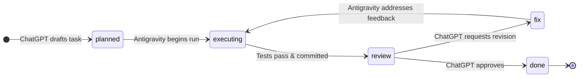

# Bridge Contract & Lifecycle Specification

This document formalizes the machine-readable and operational contract between **ChatGPT** (Planner & Reviewer) and **Antigravity** (Autonomous Implementer & Validator).

---

## 1. Operating Roles

| Agent | Role | Permitted Actions | Prohibited Actions |
| :--- | :--- | :--- | :--- |
| **ChatGPT** | **Architect & Reviewer** | • Define scope & acceptance criteria • Create/update `TASK.json` & `CURRENT_TASK.md` • Transition `planned` / `fix` / `done` • Audit diffs, logs, & test results | • Directly write code to repo • Trigger terminal execution |
| **Antigravity** | **Implementer & Validator** | • Read `TASK.json` & execute instructions • Transition `executing` / `review` • Run tests & static analysis • Commit & push verified work | • Alter scope outside `TASK.json` • Blindly run destructive operations • Mark tasks as `done` |

---

## 2. State Machine Lifecycle

### Stage Definitions
1. `planned`:
   - **Set by**: ChatGPT.
   - **File Location**: `.antigravity/bridge/tasks/<task-id>.json` (with pointer in `CURRENT_TASK.md`).
   - **Meaning**: Task is fully specified with strict acceptance criteria, constraints, and validation commands. Antigravity can pick up work immediately.
2. `executing`:
   - **Set by**: Antigravity.
   - **Meaning**: Antigravity is active, analyzing the codebase, writing code, and verifying behavior.
3. `review`:
   - **Set by**: Antigravity.
   - **Meaning**: Implementation and automated validation are 100% complete, tests are green, `flutter analyze` has 0 errors, and the commit is pushed. Antigravity is now awaiting human / ChatGPT review.
4. `fix`:
   - **Set by**: ChatGPT (or Human Reviewer).
   - **Meaning**: Audit found an issue. Reviewer appends findings to `CURRENT_TASK.md` and transitions state to `fix`. Antigravity resumes execution to remediate.
5. `done`:
   - **Set by**: ChatGPT (or Human Reviewer) ONLY.
   - **Meaning**: Final sign-off. Acceptance criteria met. **NEVER auto-transition review → done.** Antigravity is forbidden from setting this stage.

---

## 3. Safety Guardrails & Non-Negotiables

1. **Zero Blind Destructive Operations**:
   - Antigravity must NEVER drop Firestore collections, wipe databases, force-push `main`, or mass-delete files without explicit user approval in chat.
2. **Scope Confinement**:
   - Only files identified in `TASK.json` (or strictly required dependencies) may be modified.
   - Application feature code remains frozen during infrastructure or bridge tasks.
3. **Automated Verification Gate**:
   - No task may transition to `review` without running and passing specified automated test commands.
4. **No Secrets / Keys in Repo**:
   - The bridge relies strictly on Git repository states; no credentials or API tokens are saved.
