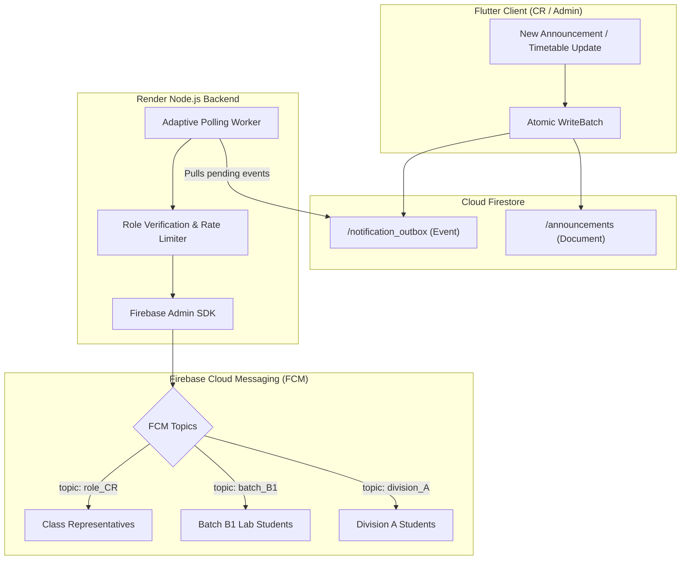

<div align="center">

# 📱 Schedly
### Next-Gen College Timetable & Real-Time Announcement System

[](https://flutter.dev)
[](https://dart.dev)
[](https://firebase.google.com)
[](https://nodejs.org)
[](LICENSE)

<p align="center">
  A high-reliability, real-time timetable and announcement distribution platform built for academic institutions. Featuring an atomic <strong>Transactional Outbox Pattern</strong> to guarantee zero-loss push notification delivery across entire college batches.
</p>

</div>

---

## ⚡ Core Features

- 📅 **Smart Timetable Sync**: Real-time lecture schedules, laboratory sessions, and professor allocations.
- 🔔 **Instant FCM Topic Broadcasts**: Instantaneous college-wide, division-specific, and batch-targeted alerts without device-token overhead.
- 🛡️ **Role-Based Access Control (RBAC)**: Secure privilege tiers for Students, Class Representatives (CR), and Student Representatives (SR).
- ⚡ **Atomic Outbox Guarantee**: Every announcement is coupled atomically with a notification payload to ensure resilient dispatch even under intermittent network conditions.
- 🌙 **Modern Fluid UI**: Responsive Flutter frontend optimized for Android & iOS with smooth transitions and offline-first caching.

---

## 🏗️ Architecture & Notification Pipeline

Schedly solves push notification drops using a distributed **Transactional Outbox Worker**:



---

## 🔒 Security Model

- **Zero Client Broadcast Access**: Mobile clients are forbidden from invoking FCM dispatch APIs directly.
- **Firestore Security Rules**: Strict document validators ensure only verified CR/SR accounts can commit to `/notification_outbox`.
- **Server-Side Token Verification**: The backend worker verifies the dispatching user's role against `/users` before routing alerts to FCM topics.

---

## 🛠️ Tech Stack

| Layer | Technology |
| :--- | :--- |
| **Mobile App** | Flutter, Dart, Provider / Riverpod, Material 3 |
| **Database & Auth** | Google Cloud Firestore, Firebase Authentication |
| **Push Engine** | Firebase Cloud Messaging (FCM Topics) |
| **Backend Outbox Service** | Node.js, Express, Firebase Admin SDK |
| **Hosting & Infra** | Render Cloud Platform |

---

## 🚀 Getting Started

### Prerequisites
- [Flutter SDK](https://docs.flutter.dev/get-started/install) (`>= 3.0.0`)
- [Node.js](https://nodejs.org/) (`>= 18.x`)
- Configured [Firebase Project](https://console.firebase.google.com/)

### Mobile Setup
```bash
# Clone the repository
git clone https://github.com/sorty11/Schedly.git

# Navigate to project root
cd Schedly

# Install Flutter dependencies
flutter pub get

# Run on connected device
flutter run
```

### Backend Worker Setup
```bash
cd server
npm install
npm run start
```

---

## 📄 License
This project is licensed under the [MIT License](LICENSE).
